<!-- Generated by tools/build.py. Edit design/content.json and design/style.css. -->
<!-- Keep adjacent image links joined: their gutters live inside the assets. -->

<a href="https://antonio-in-stem.github.io/portfolio/#/work"><picture><source media="(max-width: 600px)" srcset="assets/noir/hero-mobile.png"><source media="(max-width: 1100px)" srcset="assets/noir/hero-compact.png">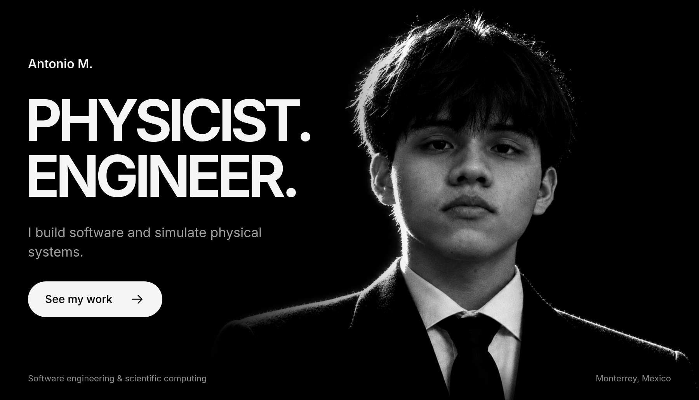</picture></a> 
<a href="https://antonio-in-stem.github.io/portfolio/#/work"><picture><source media="(max-width: 600px)" srcset="assets/noir/work-heading-mobile.png"><source media="(max-width: 1100px)" srcset="assets/noir/work-heading-compact.png">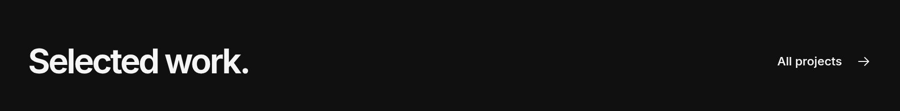</picture></a> 
<a href="https://antonio-in-stem.github.io/portfolio/#/work/diffuse"><picture><source media="(max-width: 600px)" srcset="assets/noir/diffuse-mobile.png"><source media="(max-width: 1100px)" srcset="assets/noir/diffuse-compact.png">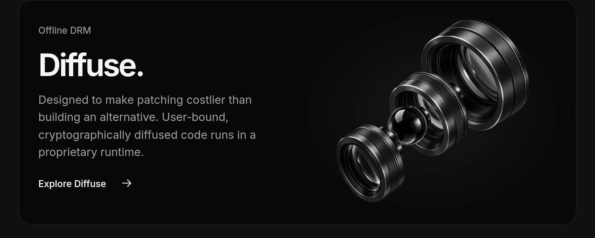</picture></a> 
<a href="https://antonio-in-stem.github.io/portfolio/#/work/abstract"><picture><source media="(max-width: 600px)" srcset="assets/noir/abstract-mobile.png"><source media="(max-width: 1100px)" srcset="assets/noir/abstract-compact.png">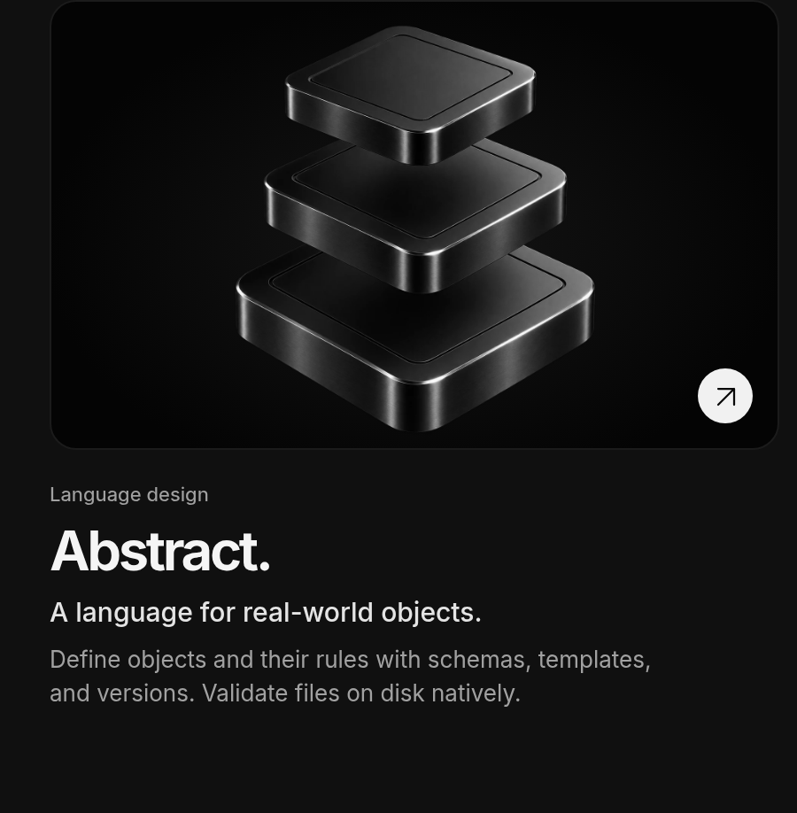</picture></a><a href="https://antonio-in-stem.github.io/portfolio/#/work/compact"><picture><source media="(max-width: 600px)" srcset="assets/noir/compact-mobile.png"><source media="(max-width: 1100px)" srcset="assets/noir/compact-compact.png">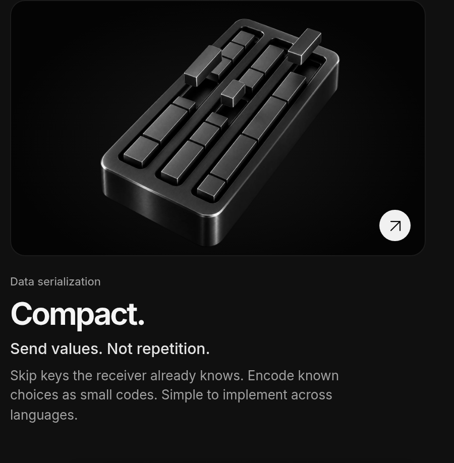</picture></a> 
<a href="https://antonio-in-stem.github.io/portfolio/#/about"><picture><source media="(max-width: 600px)" srcset="assets/noir/mindset-mobile.png"><source media="(max-width: 1100px)" srcset="assets/noir/mindset-compact.png">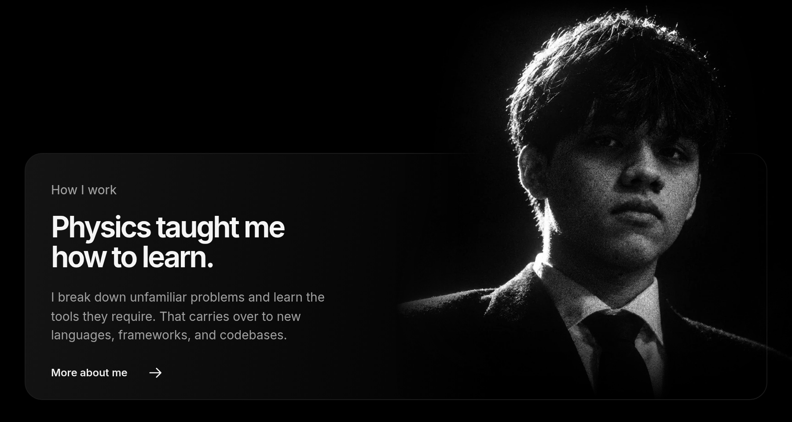</picture></a> 
<picture><source media="(max-width: 600px)" srcset="assets/noir/contact-heading-mobile.png"><source media="(max-width: 1100px)" srcset="assets/noir/contact-heading-compact.png">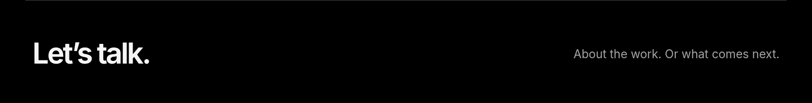</picture> 
<a href="mailto:yosoyantoniomartinez@gmail.com"><picture><source media="(max-width: 600px)" srcset="assets/noir/contact-email-mobile.png"><source media="(max-width: 1100px)" srcset="assets/noir/contact-email-compact.png">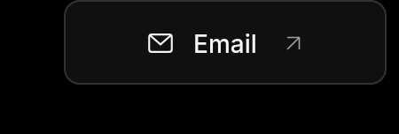</picture></a><a href="https://www.linkedin.com/in/antonio-in-stem/"><picture><source media="(max-width: 600px)" srcset="assets/noir/contact-linkedin-mobile.png"><source media="(max-width: 1100px)" srcset="assets/noir/contact-linkedin-compact.png">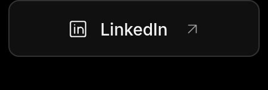</picture></a><a href="https://antonio-in-stem.github.io/portfolio/#/"><picture><source media="(max-width: 600px)" srcset="assets/noir/contact-portfolio-mobile.png"><source media="(max-width: 1100px)" srcset="assets/noir/contact-portfolio-compact.png">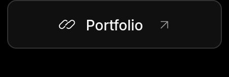</picture></a><a href="https://github.com/antonio-in-stem"><picture><source media="(max-width: 600px)" srcset="assets/noir/contact-github-mobile.png"><source media="(max-width: 1100px)" srcset="assets/noir/contact-github-compact.png">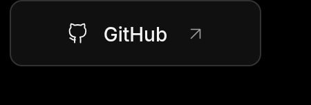</picture></a> 
<picture><source media="(max-width: 600px)" srcset="assets/noir/colophon-mobile.png"><source media="(max-width: 1100px)" srcset="assets/noir/colophon-compact.png">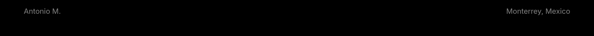</picture>

Read as text

# Antonio M.

**Physicist · Software Engineer**

I build software and simulate physical systems.

Software engineering & scientific computing. Monterrey, Mexico.

## How I work

**Physics taught me how to learn.**

I break down unfamiliar problems and learn the tools they require. That carries over to new languages, frameworks, and codebases.

I work best when turning ambiguous problems into structured solutions: models, software, and tools that become real products. Physics trained me to map phenomena to mathematical models, simulate outcomes, and reason about constraints and failure modes.

My focus is clarity, first principles, and iterative improvement.

[More about me](https://antonio-in-stem.github.io/portfolio/#/about)

## Selected work

### [Abstract](https://antonio-in-stem.github.io/portfolio/#/work/abstract)

**Model real-world objects. Make their rules explicit.**

Abstract is a language for describing real-world objects, the properties they can have, and the rules they must satisfy. Define a schema once, then create objects with allowed variations rather than repeating their structure.

A Car schema can require a steering wheel and wheels while allowing different colors, wheel types, or left- and right-hand steering. Schemas, templates, and versioning keep those definitions concise. Native validation of files on disk brings referenced assets into the same workflow.

### [Compact](https://antonio-in-stem.github.io/portfolio/#/work/compact)

**Send the values. Keep the shared structure out of the message.**

Compact is a language-agnostic serialization format designed to be simple to implement. Sender and receiver agree on the schema and field order, so the message can carry values without repeating keys or structural information they already share.

Known choices can be sent as small numeric codes instead of full strings. For example, an agreed set of blue, red, and green can use the codes 0, 1, and 2. The receiver must use the same schema to interpret them; the message is not self-describing.

### [Diffuse](https://antonio-in-stem.github.io/portfolio/#/work/diffuse)

**Offline DRM built around effort asymmetry.**

Diffuse is an offline DRM system designed to make patching a protected release more work than building an independent alternative. The objective is to change the effort equation, not to promise that leaks or bypasses are impossible.

Its approach diffuses user-specific information cryptographically throughout a binary payload that carries executable code, interpreted by a proprietary runtime.

[All projects](https://antonio-in-stem.github.io/portfolio/#/work)

## Connect

[Email](mailto:yosoyantoniomartinez@gmail.com) · [LinkedIn](https://www.linkedin.com/in/antonio-in-stem/) · [Portfolio](https://antonio-in-stem.github.io/portfolio/#/) · [GitHub](https://github.com/antonio-in-stem)

